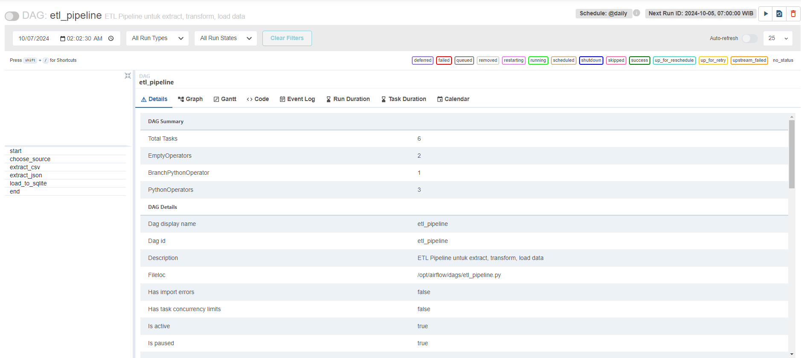
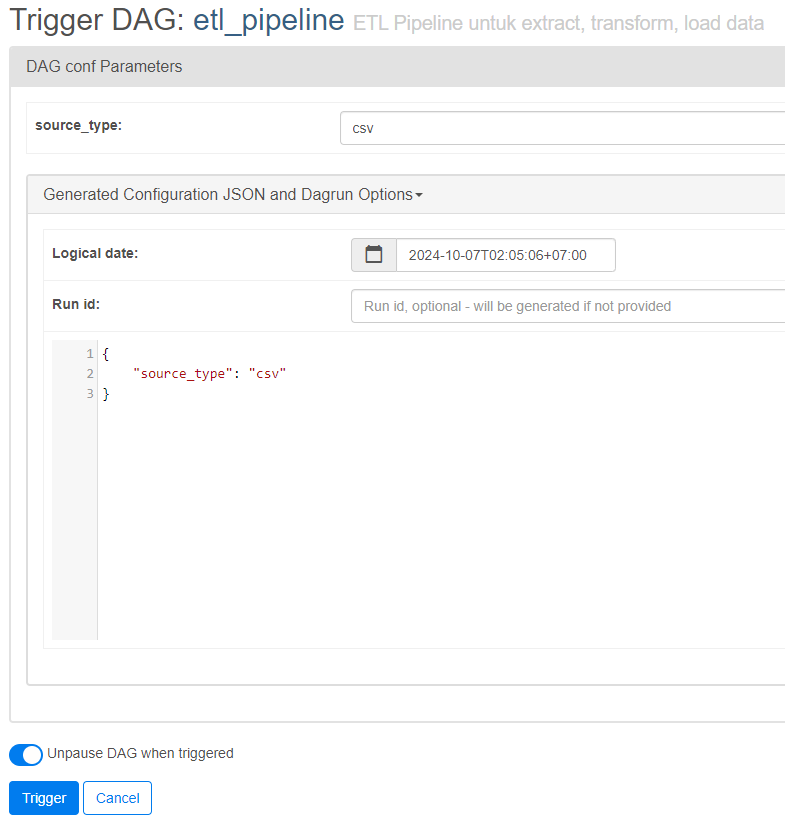
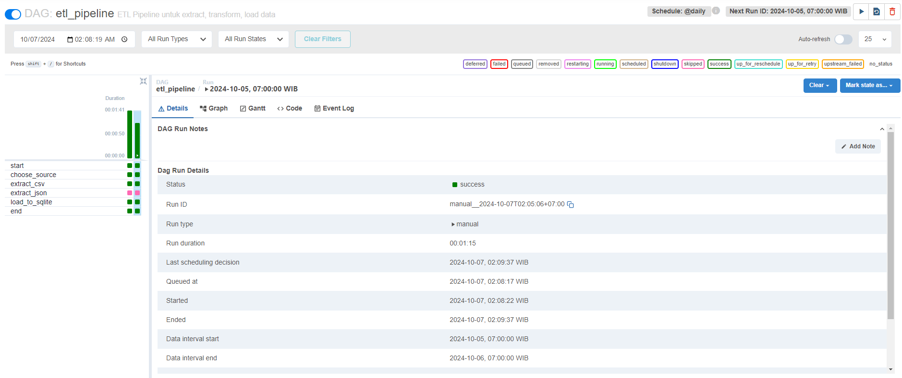
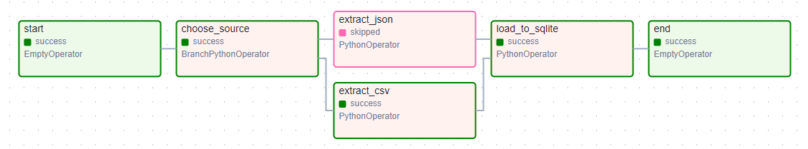
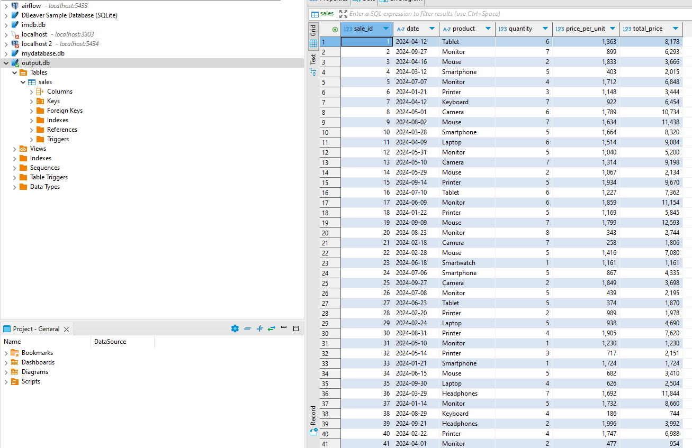
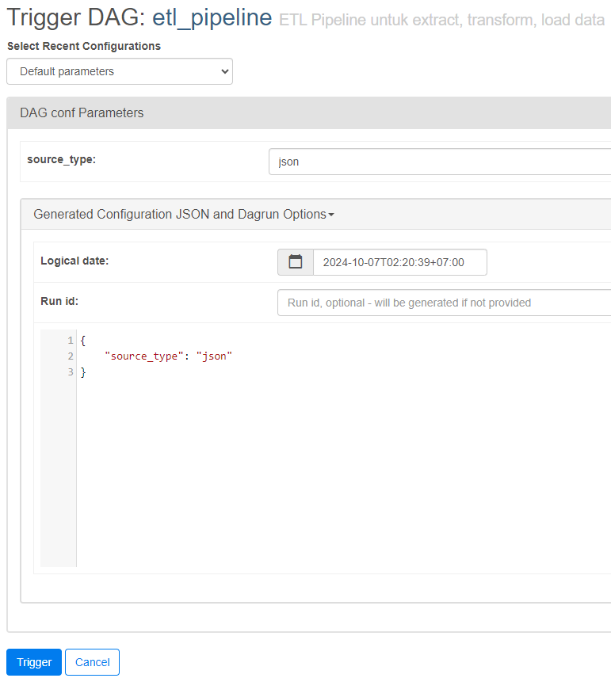
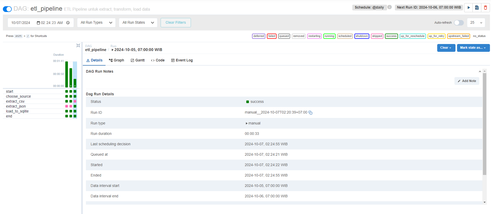
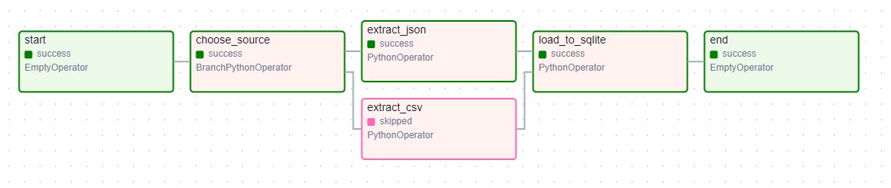
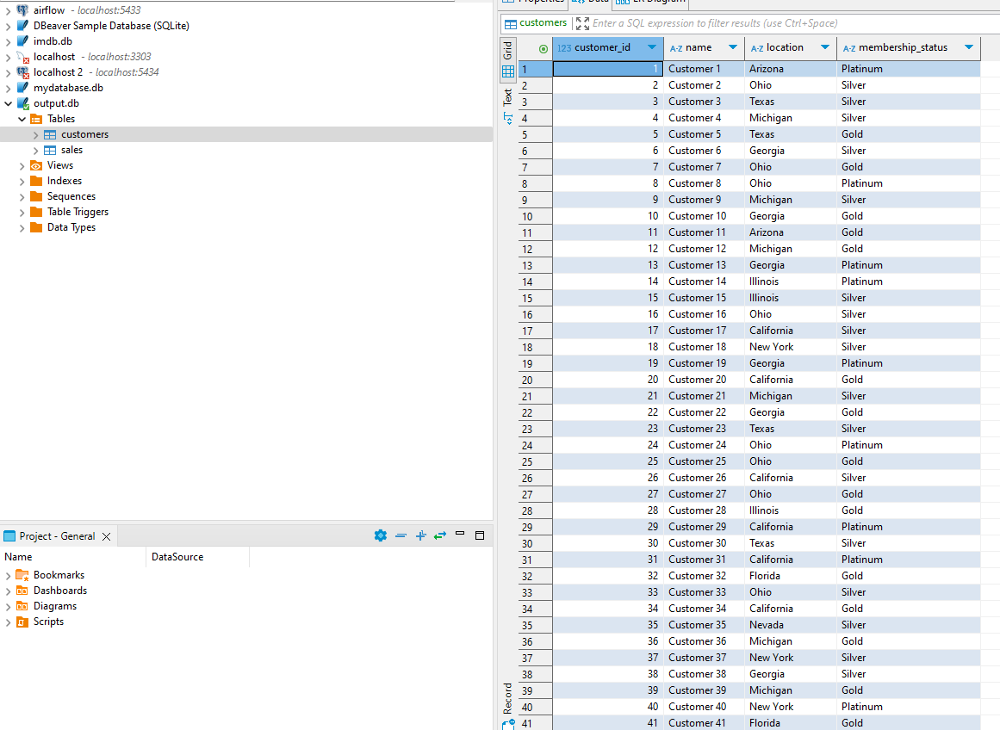

# ETL Pipeline Project

## Overview
This project implements an ETL (Extract, Transform, Load) pipeline using Apache Airflow to extract data from two different sources: `sales_data.csv` and `customers_data.json`. The project demonstrates practical understanding of using Airflow for managing ETL workflows and storing results in a SQLite database.

## Prerequisites
- Docker and Docker Compose
- Python 3.8+
- SQLite
- DBeaver (for SQLite database management)

## Installation & Setup
1. Clone this repository:
   ```bash
   git clone https://github.com/abilfarabil/airflow-etl-pipeline.git
   ```

2. Navigate to project directory:
   ```bash
   cd [project-directory]
   ```

3. Start Airflow using Docker Compose:
   ```bash
   docker-compose up -d
   ```

## Features
- ETL pipeline implementation using Apache Airflow
- Data extraction from CSV and JSON sources
- Data transformation and cleaning
- Loading data into SQLite database
- Parameterized DAG execution
- Automated workflow management

## Documentation

### DAG Configuration
The DAG can be triggered with different configurations based on the source type:

1. For CSV files:
```json
{
    "source_type": "csv"
}
```

2. For JSON files:
```json
{
    "source_type": "json"
}
```

### Implementation Steps and Results

1. DAG Configuration

- Shows all configurations related to the DAG, including DAG name and other parameters.

2. CSV Configuration Parameters

- Displays parameter settings for `sales_data.csv` extraction.

3. CSV DAG Run Status

- DAG run status when processing CSV file.

4. CSV DAG Graph

- Workflow visualization for CSV file processing.

5. SQLite Results After CSV Processing

- Extracted data from `sales_data.csv` in SQLite database.

6. JSON Configuration Parameters

- Displays parameter settings for `customers_data.json` extraction.

7. JSON DAG Run Status

- DAG run status when processing JSON file.

8. JSON DAG Graph

- Workflow visualization for JSON file processing.

9. SQLite Results After JSON Processing

- Extracted data from `customers_data.json` in SQLite database.

## Technologies Used
- Python 3.8+
- Apache Airflow 2.x
- SQLite 3
- Docker & Docker Compose
- DBeaver (latest version)

## References
- [Apache Airflow Documentation](https://airflow.apache.org/docs/)
- [SQLite Documentation](https://www.sqlite.org/docs.html)
- [Docker Documentation](https://docs.docker.com/)

## Conclusion
This project demonstrates how Airflow can be utilized to automate ETL processes from various data sources. Through DAG configuration and parameterization, you can easily extract, transform, and load data into databases, which is an essential skill in data engineering development.

## Contributing
Feel free to fork this repository and submit pull requests for any improvements.
8. Mempertahankan semua screenshot dengan deskripsi yang lebih terstruktur

Semua gambar tetap dipertahankan dengan nama file yang sama, hanya deskripsinya yang diubah ke dalam Bahasa Inggris untuk konsistensi.
